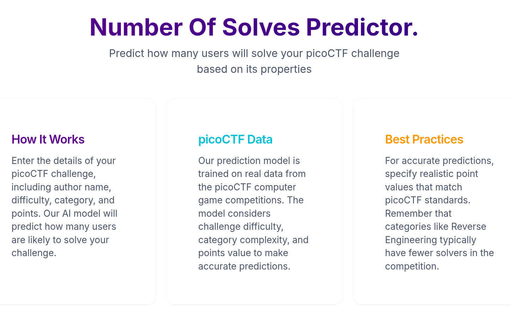

# picoCTF Solves Predictor


## Overview

The picoCTF Solves Predictor is a comprehensive tool designed to analyze challenge characteristics from the popular picoCTF cybersecurity competition and predict the number of users who will successfully solve each challenge. This project combines data collection, machine learning, and an interactive web interface to provide valuable insights for challenge creators, competitors, and educational institutions.

## Features

- **Challenge Solve Prediction**: Predict the number of competitors likely to solve a challenge based on its characteristics
- **Interactive UI**: User-friendly interface for inputting challenge parameters and visualizing predictions
- **Data-Driven Insights**: Leverages historical picoCTF challenge data for accurate predictions
- **Comprehensive Analysis**: Considers factors such as author reputation, difficulty rating, category, and point value



## Project Architecture

This project consists of two main components:

### Backend System
The backend handles data collection, preprocessing, model training, and prediction serving:

1. **Data Collection**: Web scraping system that gathers challenge data from the picoCTF platform
2. **Data Preprocessing**: Transforms raw challenge data into features suitable for machine learning
3. **Model Training**: CatBoost-based regression model trained to predict solve counts
4. **Prediction API**: FastAPI endpoint that serves predictions to the frontend

### Frontend Application
The frontend provides an intuitive user interface for accessing the prediction system:

1. **Prediction Form**: Interactive form for submitting challenge parameters
2. **Results Visualization**: Dynamic charts and displays for presenting prediction results
3. **Challenge Information**: Contextual information about picoCTF challenge categories and metrics
4. **Responsive Design**: Optimized for both desktop and mobile devices

## How It Works


1. The user enters challenge details through the frontend interface (author, difficulty, category, point value)
2. The frontend sends this data to the backend API
3. The backend processes the input using the pre-trained CatBoost model
4. The prediction is returned to the frontend and displayed to the user
5. Users can adjust parameters to see how different factors affect the predicted solve count

## Technologies Used

### Backend Technologies
- Python 3.8+
- FastAPI
- CatBoost
- pandas & NumPy
- Selenium/undetected-chromedriver
- Jupyter Notebooks

### Frontend Technologies  
- React 18
- TypeScript
- Vite
- Tailwind CSS
- React Query (TanStack)
- Recharts
- Radix UI Components

## Getting Started

### Prerequisites

- Node.js (v18+) for frontend
- Python 3.8+ for backend
- pnpm package manager (frontend)
- Chrome browser (for backend scraping)

### Installation

#### Backend Setup

```bash
# Clone the repository
git clone https://github.com/yvesHakizimana/picoCTF-solves-predictor.git
cd picoCTF-solves-predictor

# Set up backend
cd backend
python -m venv .venv
source .venv/bin/activate  # On Windows: .venv\Scripts\activate
pip install -r requirements.txt

# Start the backend API
python main.py
```

#### Frontend Setup

```bash
# From the project root
cd fronted
pnpm install
pnpm dev
```

The frontend will be accessible at http://localhost:8000, and the backend API will be running at http://localhost:8080.

## Detailed Documentation

For more detailed information about each component, please refer to the dedicated README files:

- [Frontend Documentation](fronted/README.md) - Detailed information about the UI components, architecture, and features
- [Backend Documentation](backend/README.md) - Comprehensive guide to the data pipeline, model training, and API

## Data Workflow

1. **Data Collection**: Challenge data is scraped from the picoCTF platform
2. **Data Preprocessing**: Raw data is cleaned, transformed, and engineered into model features
3. **Model Training**: A CatBoost regression model is trained on historical challenge data
4. **Prediction**: The model generates predictions based on user-specified challenge characteristics
5. **Visualization**: Results are presented to the user through an intuitive interface

## Use Cases

- **Competition Organizers**: Calibrate challenge difficulty based on expected solve rates
- **Challenge Authors**: Estimate how many competitors will solve their challenges
- **Educators**: Select appropriate challenges for different skill levels
- **Competitors**: Assess which challenges might be worth attempting based on typical solve rates

## Contributing

We welcome contributions to improve the picoCTF Solves Predictor!

1. Fork the repository
2. Create your feature branch (`git checkout -b feature/amazing-feature`)
3. Set up the development environment (see Installation instructions)
4. Make your changes
5. Commit your changes (`git commit -m 'Add some amazing feature'`)
6. Push to the branch (`git push origin feature/amazing-feature`)
7. Open a Pull Request

Please see the specific contribution guidelines in the [Frontend README](fronted/README.md) and [Backend README](backend/README.md) for more detailed instructions.

## License

This project is licensed under the Rwanda Coding Academy License.

## Acknowledgments

- picoCTF for inspiring this project and providing the competition platform
- All contributors who have helped develop and improve this tool
- The open-source community for the amazing libraries and frameworks used in this project

---

*The picoCTF Solves Predictor aims to provide valuable insights into challenge difficulty and solve rates, helping to improve the educational value of cybersecurity competitions.*
